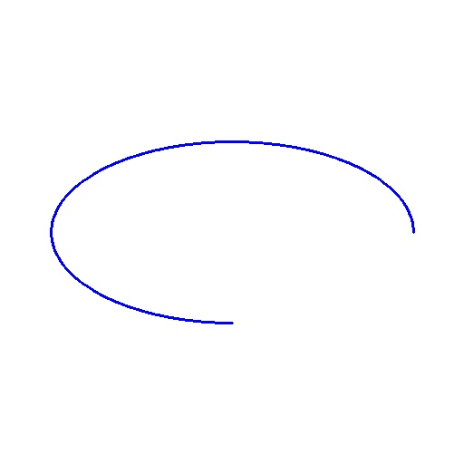
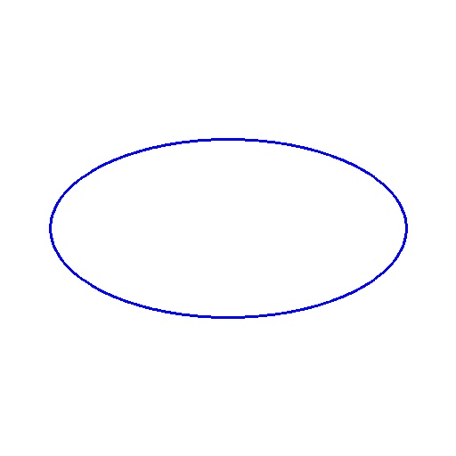

## Installation
```
pip install opencv-python
```

## Read
- `openCV.imread(imagePath)` - load the image from the specified path

- `openCV.imshow(frameName, image)` - display an image in a window

- `openCV.waitKey(0)` -  allows users to display a window for given milliseconds or until any key is pressed. If the parameter value is 0, you have to press any key from your keyboard to destroy the window, untill it will keep open. If the parameter value is other value instead of 0, it will automatically destroy the window after that amount of milliseconds

- `openCV.destroyAllWindows()` - close all open window. [View More](https://www.geeksforgeeks.org/python-opencv-destroyallwindows-function/)

- `destroyWindow(windName)` - close a specif window

## Draw Line
- `dtype=np.uint8` - specifies the data type of the elements in the array.
- `np.zeros((3, 3))` - creates a 3x3 array filled with zeros
- `np.ones((3, 3))` - creates a 3x3 array filled with ones
- `np.full((2, 2), 5)` - creates a 2x2 array filled with the value 5
- `np.empty((2, 2))` - creates a 2x2 uninitialized array
- `np.eye(3)` or `np.identity(3)` - creates a 3x3 identity matrix
- `np.ones((512, 512, 3))` - creates 512x512 array which filled with 1x3 array which is filled with the value 1
- `255*np.ones((512, 512, 3))` - creates a 3-dimensional with 512 rows, 512 columns and 3 depth or color channels. It means each of the value of 512*512 array have another array which contains a list of 3 value represnt rgb color code. It is used to create white image.

```
import cv2 as openCV
import numpy as np

image = 255 * np.ones((512, 512, 3), dtype=np.uint8)

start_point = (100, 100)
end_point = (400, 400)
color = (255, 0, 0)
thickness = 2

openCV.line(image, start_point, end_point, color, thickness)

openCV.imshow('Line Image', image)
openCV.waitKey(0)
openCV.destroyAllWindows()

``` 


## Draw Circle
- `thickness=-1` or `thickness=openCV.FILLED` - filled the shape with color
```
import cv2 as openCV
import numpy as np

image = 255 * np.ones((512, 512, 3), dtype=np.uint8)

center_coordinates = (256, 256)
radius = 100
color = (255, 0, 0)
thickness = 2

openCV.circle(image, center_coordinates, radius, color, thickness)

openCV.imshow('Line Image', image)
openCV.waitKey(0)
openCV.destroyAllWindows()
```


## Draw Rectangle
- `start_point` - specify the position of top left corner of the rectangle
- `end_point` - specify the position of bottom right corner of the rectangle

```
import cv2 as openCV
import numpy as np

image = 255 * np.ones((512, 512, 3), dtype=np.uint8)

start_point = (100, 100)
end_point = (400, 400)
color = (255, 0, 0)
thickness = 2

openCV.rectangle(image, start_point, end_point, color, thickness)

openCV.imshow('Line Image', image)
openCV.waitKey(0)
openCV.destroyAllWindows()
```


## Draw Ellipse
- `center_coordinates` - Specifies the center of the ellipse.
- `axes_length` - Specifies the length of horizontal & vertical axes
- `angle` - Specifies the rotation angle of the ellipse (in degrees) from horizontal line.
- `startAngle` - Specifies the angle (in degrees) at which the ellipse arc starts. It defines the beginning of the arc.
- `endAngle` - Specifies the angle (in degrees) at which the ellipse arc ends. It defines the termination point of the arc.
```
import cv2 as openCV
import numpy as np

image = 255 * np.ones((512, 512, 3), dtype=np.uint8)

center_coordinates = (256, 256)
axes_length = (200, 100)
angle = 0 
startAngle = 0
endAngle = 360 
color = (255, 0, 0)
thickness = 2

openCV.ellipse(image, center_coordinates, axes_length, angle, startAngle, endAngle, color, thickness)

openCV.imshow('Ellipse Image', image)
openCV.waitKey(0)
openCV.destroyAllWindows()
```



## Draw Polygon
- `isClosed` - A boolean flag indicating whether the last point should be connected to the first point to form a closed loop.
- `pts` - it ontains the coordinates of the vertices of the polygon. Each row represents a vertex, and the polygon will be formed by connecting these vertices in the order they appear in the array.
```
import cv2 as openCV
import numpy as np

image = 255 * np.ones((512, 512, 3), dtype=np.uint8)

pts = np.array([
        [100, 100], 
        [300, 100], 
        [400, 200], 
        [200, 400]
    ],np.int32
)

pts = pts.reshape((-1, 1, 2))
isClosed = True
color = (255, 0, 0)
thickness = 2

openCV.polylines(image, [pts], isClosed, color, thickness)

openCV.imshow('Line Image', image)
openCV.waitKey(0)
openCV.destroyAllWindows()
```


## Draw Text
- `position` - The coordinates (x, y) where the text should be positioned on the image.
- `fontFamily` - The font style to be used for the text. 
- `fontScale` - The scale factor that multiplies the font size.
```
import cv2 as openCV
import numpy as np

image = 255 * np.ones((512, 512, 3), dtype=np.uint8)

text = 'Hello, OpenCV!'
position = (150, 250)
fontFamily = openCV.FONT_HERSHEY_SIMPLEX
fontScale = 1
color = (255, 0, 0)
thickness = 2

openCV.putText(image, text, position, fontFamily, fontScale, color, thickness)

openCV.imshow('Line Image', image)
openCV.waitKey(0)
openCV.destroyAllWindows()
```


## Resizing
- `None` - It specifies that you're not providing explicit target dimensions for the resized image. When None is provided, OpenCV calculates the size of the output image based on the specified scaling factors.
- `camera.set(property_identifier, value)` - is used to change the resolution of a live video stream. It doesn't work with images or video, only with live video stream.
```
import cv2 as openCV
import numpy as np

imagePath="images/img1.png"
image = openCV.imread(imagePath)

new_width = 400
new_height = 300
resized_image = openCV.resize(image, (new_width, new_height))

scale_factor = 0.5
scaled_image = openCV.resize(image, None, fx=scale_factor, fy=scale_factor)

openCV.imshow('Original Image', image)
openCV.imshow('Resized Image', resized_image)
openCV.imshow('Scaled Image', scaled_image)

openCV.waitKey(0)
openCV.destroyAllWindows()
```

## Image Property
- `shape` - return a list containing (height, width, channels)
- `size` - returns the total number of elements in the image array, which is the product of its width, height, and number of channels.
- `ndim` - returns the number of dimensions of the image array. For example, grayscale images have 2 dimensions (height and width), while color images have 3 dimensions (height, width, and channels). 
- `min()` and `max()` - return the minimum and maximum pixel values in the image array, respectively.
- `mean()` and `std()` - return the mean and standard deviation of pixel values in the image array, respectively.

## Splitting & Merging

__Concatenation__ involves arranging multiple images side by side or on top of each other to create a larger image. __Merging__ involves combining the pixel values of two or more images to create a new image. __Splitting__ involves separating the color chanels.

- `openCV.split(image)` - splits the input image into its individual channels: blue, green, red. The result is three separate arrays representing the intensity of each color channel across the entire image. Each pixel of given image have 3 different color value, this method separate it and blue value return in blue part and so on. Splitting an image into its individual color channels allows you to analyze or manipulate each color component separately. For example, you can perform operations such as adjusting the brightness or contrast of a specific color channel, enhancing certain colors, or creating special effects.

- `openCV.merge((b, g, r))` - merges the individual color channels. Merging the individual color channels back together is often necessary after performing operations on individual channels, such as color manipulation or filtering, to reconstruct the complete image with the desired modifications.

- `openCV.hconcat()` - is used to concatenate the images horizontally by passing a list of images to concatenate.
- `openCV.vconcat()` - is used to concatenate the images vertically by passing a list of images to concatenate.

### Uses:
__Color Correction:__ Correcting color balance in an image might need to adjust the intensity of each color chanel independently. For example, if an image appears too blue due to incorrect white balance, you can reduce the intensity of the blue channel to balance the colors.

__Image Enhancement:__ if you want to enhance the contrast of the sky in a landscape photo, you might adjust the intensity of the blue channel to make the sky more vibrant without affecting other parts of the image.

__Feature Extraction:__ Object detection rely on specific color information. For example, in medical imaging, certain tissues or structures might be more distinguishable in a particular color channel.

__Water Detection:__ Water bodies can be detected by analyzing the intensity of the blue channel. Water usually absorbs more red and green light, while reflecting more blue light, making it stand out in the blue channel.

__Night Vision:__ Green color channels are often emphasized because the human eye is most sensitive to green light. By merging a grayscale image with an enhanced green channel, you can improve visibility in low-light conditions while preserving important details.

## Arithmatic Operations

__Brightness:__ Adding a `constant` value to every pixel in an image increases its brightness, while subtracting decreases it. This operation is often used for adjusting the exposure of images.

__Contrast:__ Multiplying every pixel in an image by a `constant` value increases its contrast, while dividing decreases it. Contrast adjustment helps in enhancing the visual quality of images.

__Motion Detection:__ Subtracting one image from another can highlight the differences between them. This operation is useful in applications such as motion detection, where consecutive frames of a video are subtracted to identify moving objects.

__Masking:__ Multiplying an image by a` binary mask` (where pixel values are either 0 or 1) selectively applies the mask to the image. This technique is commonly used for image segmentation and region-of-interest extraction.

## Grayscale Image
Grayscale Image only contain a single channel representing the intensity of light at each pixel, without any color information. It is achieved by taking a `weighted sum of the Red, Green, and Blue channels` of the original image. The weights are typically chosen to match the perceived brightness of the different color channels. Finally, the resulting intensity value is assigned to each pixel in the grayscale image.

## HSV Image
An HSV color model is the most accurate color model as long as the way humans perceive colors. How humans perceive colors is not like how RGB or CMYK make colors. They are just primary colors fused to create the spectrum.

- `Hue` - It represents the color itself. It is typically represented as an angle around a color wheel, ranging from 0 to 360 degrees, covering the spectrum of colors.
- `Saturation` - It represents the purity of the color. Higher saturation values indicate more vibrant colors, while lower values approach shades of gray.
- `Value` - It represents the brightness or intensity of the color. Higher values correspond to brighter colors, while lower values approach black.

Pixel value:&nbsp;&nbsp;&nbsp;&nbsp;&nbsp;&nbsp;&nbsp;&nbsp;&nbsp;&nbsp;&nbsp;&nbsp;[240 221 210]<br>
HSV value of 240: [109  32 240]

|Angle|Color|
|---|---|
|0-60|Red|
|60-120|Yellow|
|120-180|Green|
|180-240|Cyan|
|240-300|Blue|
|300-360|Magenta|


## Blur Image
A blurred image is an image in which the sharpness or details have been reduced intentionally through a process known as blurring. Blurring is a common technique in image processing used to reduce noise, smooth out irregularities, or obscure details in an image.

```
   Original   =>    Blurred
[243 224 213] => [240 221 210]
[243 225 214] => [244 225 214]
[244 228 218] => [245 228 219]
```

## Contours Detection

Contours are curves joining continuous points along a boundary that have the **same color** or intensity